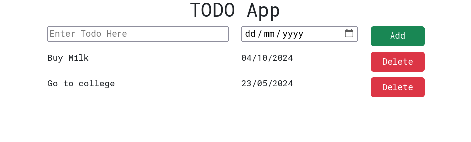

# Basic Todo UI

This is a **Basic Todo List UI**. It is built using **React** and **Bootstrap**. 

## Tech Stack

- **React**: A JavaScript library for building user interfaces.
- **Bootstrap**: CSS framework for responsive and mobile-first web design.

## Screenshot

